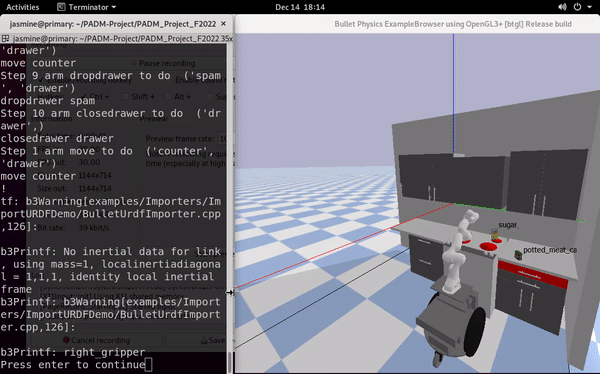

# 16.413 PADM Project Fall 2022

<!-------------------------------------------------------------------------->
<i>Jasmine Jerry Aloor and Alissa Chavalithumrong</i>
## Contents ##
1. [Introduction](#introduction)
2. [Part 1: Activity Planning](#section-1-activity-planning)
3. [Part 2: Motion Planning](#section-2-sample-based-motion-planning)
4. [Part 3: Trajectory Optimization](#section-3-trajectory-optimization)

## Introduction

#### <b> Project Objectives </b>
- In a provided kitchen simulation enviroment pick and place food items into goal positions using a robotic arm (Franka "Panda")
   - Place spam in drawer
   - Place sugar on countertop


#### <b> Overall Learning Objectives </b>
- Apply search, planning, constraint satisfaction, optimization, and probabilistic 
reasoning algorithms to real-world autonomy and decision-making problems
- Implement  search,  planning,  constraint  satisfaction, and optimization.
- Learn about problem formulations using .pddl
- Implement pybullet and pydrake libaries

<!-------------------------------------------------------------------------->

## Section 1: Activity Planning

#### <b> Assumptions Made </b>
1. Every item location is known and can be reached by the robot.

#### <b> Plan Generation </b>

 We design our `object` type to be made up of a `location` and a `locatable`. From there, we break down our `locations` to be `top`,  and `drawer`. Similarly, our `locatables` are `food` and `bot`. This is illustrated in <i>Figure 1</i>.

 In our problem.pddl file, through typing, we are able to specify our object. Spam and sugar are listed as a `food` type. The gripper is a special `locatable` that will be frequently queried, we use `robot` to further classify it. Our locations are broken down as drawer as `drawer` and countertop and stovetop as `top`. This is due to specific contraints that are required when placing items on a top vs drawer locations.

In our domain file, we have 4 predicates

- `(gripper-empty)`: is the gripper empty? 
- `(gripper-holding ?object - locatable)`: what object is the gripper holding?
- `(on ?location - location ?object - locatable)`: what location is an object? 
- `(drawer-open)`: is the drawer open?

<p align="center">
 
 </p>

 <p align="center"> <i>Figure 1:</i> Domain heirarchy  </p>

#### <b> File Structure </b>

- `domain.pddl`: defines the “universal” aspects of the kitchen problem
- `problem.pddl`: defines the global “worldly” aspects of the kitchen problem
- `planner.py`: takes .pddl files and uses breath-first search to calculate a plan

#### <b> Results </b>

<details>
<summary>planner.py output</summary>

```{python}
Time: 0.00167083740234375s
plan:
move arm counter drawer
opendrawer arm drawer
move arm drawer stove
pickuptop arm sugar stove
move arm stove counter
droptop arm sugar counter
pickuptop arm spam counter
move arm counter drawer
dropdrawer arm spam drawer
closedrawer arm drawer
```

</details>

#### <b> Challenges </b>
- In our first iteration of the .pddl files, we struggled with generating a valid domain and problem file that was solvable by our planner. 

<!-------------------------------------------------------------------------->

## Section 2: Sample Based Motion Planning

#### <b> Assumptions Made </b>
1. All locatables (spam box and sugar box) and locations (countertop, drawer, stovetop) goal positions are known to the robot/motion planner. We also assume they are static and are at the sam e position during every run.
2. Because the robotic gripper can reach all desired goal positions from one location near the kitchen, our base spawn location will be at that fixed position. Our spawn arm position will initalize in a neutral position where there are no possible collisions.
3. The drawer is moved by bringing the arm close to the drawer handle and setting the open and shut ranges of the drawer appropriately. (We used 0.0 as closed and 0.4 as open)
4. In the case of picking up, dropping, and opening/closing the drawer, we hard-coded each item to attach to the gripper when the gripper was brought close to it (with an error less than 0.05 in the joint space) and move with it. 


#### <b> RRT Motion Planner </b>

The motion planner that was implimented was RRT (with goal biasing). We used RRT to calculate a path from our initial arm joint positions to a final joint goal position while avoiding collisions.
We generated an activity plan from our PDDL planner, and from there parsed the actions and parameters. 

For example, in the  activity step `move arm counter drawer`, we would move the `arm` from it's current position at the `counter` to the `drawer`. 
This is then passed into our Executor class in the root file `project_run.py`.

Determining the collision, distance, sample, and extend functions for the current simulation, which are subsequently given to the motion planner, was crucial to completing this task. The choice of whether to define points and paths in cartesian or joint space had to be made first. The latter was chosen since transferring this to cartesian space would be rather complicated and not unique, but in joint space all reachable configurations may simply be represented by the joint limits.
Then, sampling in joint space can be easily accomplished by selecting a value at random between each joint's minimum and maximum joint angle. We used liner interpolator to determine the shortest path between two points. The cost funtion was the mean squared error from the current joint state to the target joint state

We then iterate through each step in of the activity plan and have the robot perform each action using RRT with goal biasing for the motions. We use a sample generator function similar to the example script provided. Once we get the manipulator arm to the required position from the path given by RRT, we proceed with the activity planner accordingly. As the objects are close by, we can generate the target joint angles using inverse kinematics (in-built functions which are provided by PyBullet).

<i>Note: We had three types of visualiztion in our solution and decided to stick to the fastest one for the recording of the video in the interest of time. This made the arm motions awkward but we can sitch to more smoother arm motions for a more natural motion of the robot arm.
1. We had the arm motions for RRT search tree which moved the arm violently for every sample joint ange set generated and had to remove that. We had to remove this feature as the application ended once a sample generated caused a collision.
2. We had the arm iterate over the path found by RRT slowly showing a smoother motion (visualization in Section 3)
3. We had a fast iteration over the path to quickly move the arm to the desired goal configurations (SHown in result video below)</i>


#### <b> Results</b>

<p align="center">
 
 </p>


#### <b> File Structure </b>

- `collision.py`: contains collision checking functions for rrt
- `rrt2.py`: contains the class for rrt functions
- `utils.py`: helper functions for rrt
- `planner.py`: planner implementation 
- `project_run.py`: final file to run the executor

#### <b> Challenges</b>

This was the section that challenged us the most. Our unfamiliarity with pybullet, getting a Linux virtual machine compatible to run our arm-based Mac systems, and the libraries and installations involved took a while. The initial problem formulation made the inital startup for this section very time consuming. 

A key challenge we faced was understanding how to implement a collision checker. We tried multiple methods including running a separate headless engine just to check if collision free paths exist for RRT. After a lot of brainstorming, we figured we could utilize the in-built pairwise link collision checking function. Once this was cleared, we could complete the implementation of our RRT algorithm.

The next challenge we faced was in integrating the activity plan and our RRT algorithm together. At times, RRT took a long time to find a solution to a target pose. After discussion and generating multiple ideas, we settled on using the planner to create a dictionary of required poses and joint angles for each of the activities mentioned. We then iterate over the plan again query the dictionary for the reuired target poses for the arm. This enabled us to get a fast solution.

A final challenge we faced was understanding how to stow the Spam container, and we settled to place it on the drawer and shut it accordingly.

<!-------------------------------------------------------------------------->

## Section 3: Trajectory Optimization

#### <b> Optimization Problem </b>

In our optimization problem, we decided to minimize distance travelled per joint. By optimizing for distance, we are able to create the shortest and smoothest path. We seed our optimization problem with a path generated by RRT, and then use the general solver `pydrake.Solve` to calculate a solution. 

$$
\displaystyle{
    \begin{aligned} 
        \min_{x} &\qquad |X_{0:n-1} - X_{1:n}|^2        \\
        \text{subject to} &\qquad X_0 = \text{starting pose} \\
        &\qquad X_n = \text{goal pose} \\
        &\qquad L_{lower} \le X_i \le L_{upper}  &\qquad i = 0, 1, 2, ... \space n\\
        &\qquad X_{i+1} - X_i \le T &\qquad i = 0, 1, 2, ... \space n
         \\
    \end{aligned}
}
$$

Our constraint optimization problem is formalized above, where $X$ is a $n \times 7$ matrix representing our $7$ joint positions over $n$ time-steps. 
The cost function calculates the distance travelled by every joint at each timestep. 
Our constraints are as follows: 
time-step (row) $0$ and $n$ must be equal to our starting and goal poses, 
joint positions at any time step cannot exceed lower ( $L_{lower}$ ) and upper ( $L_{upper}$ ) joint limits,
and joint distance at any timestep cannot exceed $T$ (a vector representing max distance each joint is able to travel). 

#### <b> Results</b>

<p align="center">
 
 </p>

Here is our resulting optimized trajectory. The red dots represent the trajectory generated by our RRT planner. The blue dots represents the new optimized trajectory.

#### <b> File Structure</b>

Our trajectory optimization code is contained within `optimization.py`.

It consists of 3 main functions:

- `trajectory_file_to_nparray`: converts trajectory_path.txt into a numpy array
- `optimization`: runs the pydrake optimazation solver and produces the new optimized trajectory (optimized_trajectory_path.npy)
- `run_optimization_simulation`: runs simulation in pybullet

#### <b> Challenges</b>
An issue that we ran into as formulating the optimization problem so that it was solvable by pydrake. IPopt and SNopt had issues solving matricies over 10 rows, which was difficult to use when our RRT code would produce trajectories of over 100 positions. We switched to using the general `pydrake.Solve` function, which allowed for pydrake to automatically select a solver that worked for our formulation. 

Additionally, we had great difficulty in getting pyDrake installed in one of our systems due to multiple levels of library and dependency version mistmatch and had to rely on one system for this section. But we are glad it all worked out.

##  Conclusion

In this project we learnt a lot on manipulator motion planning and usage of PyBullet as a simulator. We were able to successfully come up with a solution for the three sections of the project.

Although our solution is not the most robust, due to several aspects of the arm movements that were 'hard coded' (such as goal arm positioning for objects and drawer movements), we were able to sucessfully compelete every section of the project. 

Our group worked well together. We utilized our computing resources efficiently. We were able to creatively come up with solutions to problems and contribute equally on all sections.  ❤️‍🔥 
