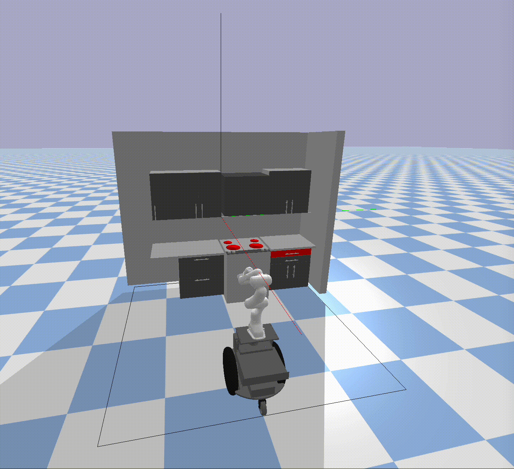

# PADM_Project_F2022

## Section 1: Activity Planning

*need to update this section with new domain+planner*

#### <b> Assumptions Made </b>
1. An item can only be in one location at a time
2. Every item location is known

#### <b> Plan Generation </b>
<!--
 We define the objects and  also mark the food items and  the gripper as locatable, to help us query the locations of these objects using a predicate we’ll create later.
 -->

 We design our `object` type to be made up of a `location` and a `locatable`. From there, we break down our `locations` to be `top`,  and `drawer`. Similarly, our `locatables` are `sugarbox, spambox` and `gripper`. Because the `gripper` is a special `locatable` that will be frequently queried, we use `robot` to further classify it. This is shown in Figure 1. 

In our domain file, we have 5 predicates

- `(gripper-empty)`: is the gripper empty? 
- `(gripper-holding ?object - locatable)`: what object is the gripper holding?
- `(on ?location - location ?object - locatable)`: what location is an object? 
- `(drawer-open)`: is the drawer open?
- `(path ?to - location ?from - location)`: what paths can be taken? [may be a redundent predicate, as all paths between locations are valid]
 
 

 <i>Figure 1: </i> Domain heirarchy

#### <b> Challenges </b>
- understanding typing

## Section 2: Sample Based Motion Planning

The planning algorithm choosen was RRT on the Franka Panda robot. 

- Qualitatively mention your assumptions that you made about the environment, state space, and start and goal positions
- Explain the files and the motion planners you implemented
- Explain how you integrated the activity plan with the motion plan
- GIF/video of the robot executing the plan and embedded in the README

## Section 3: Trajectory Optimization

