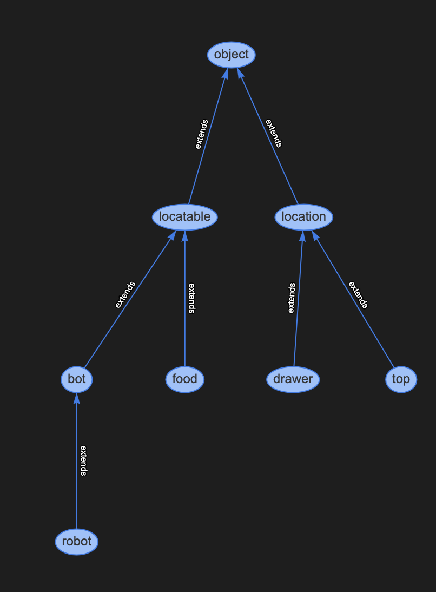

# PADM_Project_F2022

## Section 1: Activity Planning

#### <b> Assumptions Made </b>
1. An item can only be in one location at a time
2. Every item location is known

#### <b> Plan Generation </b>
<!--
 We define the objects and  also mark the food items and  the gripper as locatable, to help us query the locations of these objects using a predicate we’ll create later.
 -->

 We design our `object` type to be made up of a `location` and a `locatable`. From there, we break down our `locations` to be `top`,  and `drawer`. Similarly, our `locatables` are `food` and `bot`. This is illustrated in <i>Figure 1</i>.

 In our problem.pddl file, through typing, we are able to specify our object. Spam and sugar are listed as a `food` type. The gripper is a special `locatable` that will be frequently queried, we use `robot` to further classify it. Our locations are broken down as drawer as `drawer` and countertop and stovetop as `top`. This is due to specific contraints that are required when placing items on a top vs drawer locations.

In our domain file, we have 5 predicates

- `(gripper-empty)`: is the gripper empty? 
- `(gripper-holding ?object - locatable)`: what object is the gripper holding?
- `(on ?location - location ?object - locatable)`: what location is an object? 
- `(drawer-open)`: is the drawer open?
- `(path ?to - location ?from - location)`: what paths can be taken? [may be a redundent predicate, as all paths between locations are valid]

 
 

 
 <i>Figure 1:</i> Domain heirarchy  

#### <b> Challenges </b>
- In our first iteration of the .pddl files, we struggled with generating a valid domain and planner file as it was our first time using .pddl - but with typing, we were able to create a plan.

## Section 2: Sample Based Motion Planning

<!--
- Qualitatively mention your assumptions that you made about the environment, state space, and start and goal positions
- Explain the files and the motion planners you implemented
- Explain how you integrated the activity plan with the motion plan
- GIF/video of the robot executing the plan and embedded in the README
-->

#### <b> Assumptions Made </b>
1. All locatables (spam box and sugar box) and locations (countertop, drawer, stovetop) positions are known to the robot/motion planner. 
2. Because the robotic gripper can reach all desired goal positions from one  location near the kitchen, our base spawn location will be at that fixed position. Our spawn arm position will be in a neutral position with no possible collisions. 

#### <b> Motion Planner </b>
The motion planning algorithm we chose was RRT. 

#### <b> Files </b>

#### <b> Plan Execution </b>

 
 *insert gif here* 

